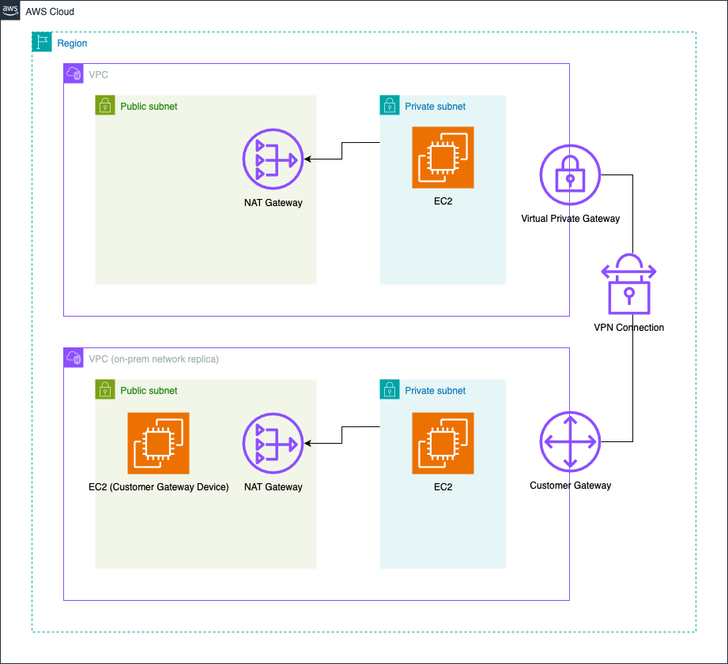
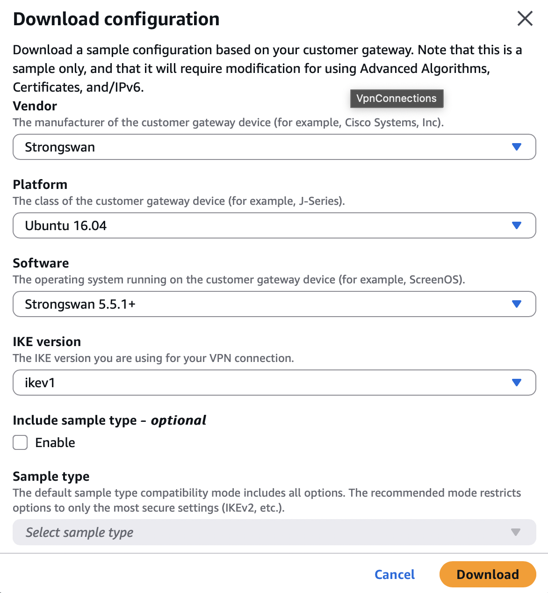
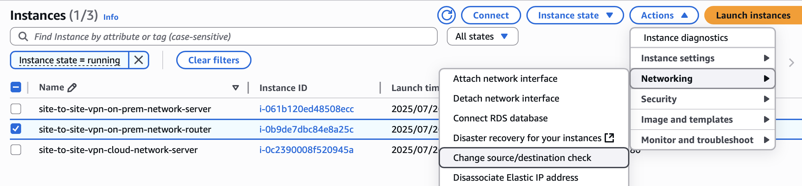
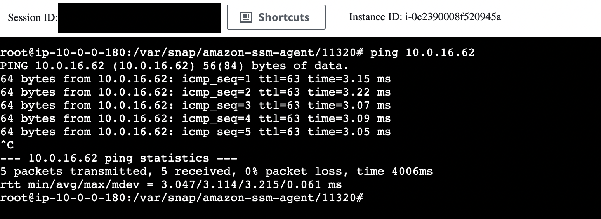
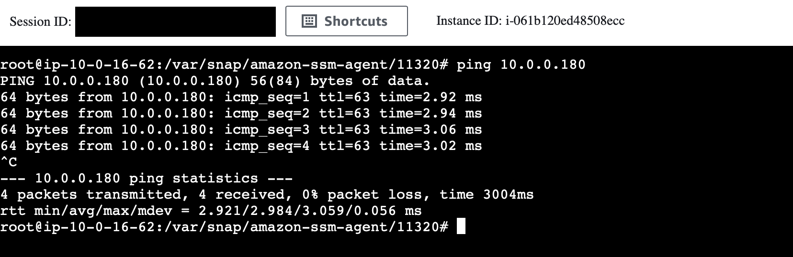

# Site-to-Site VPN

A secure site-to-site VPN implementation for connecting cloud and on-premises networks using AWS CDK.

## Overview

This project creates a site-to-site VPN connection between:

- **Cloud Network**: AWS VPC with resources
- **On-Premises Network**: Simulated on-premises environment using a separate VPC with StrongSwan running on an EC2 instance to serve as a customer gateway device.



## Deployment steps

### 1. Environment Setup

```bash
# Activate virtual environment
source .venv/bin/activate

# Install dependencies
pip install -r requirements.txt
```

### 2. Deploy Infrastructure

```bash
# Deploy the stack
cdk deploy --context stack=site-to-site-vpn
```

### 3. Configure VPN Connection

After deployment, configure the VPN tunnels:

1. **Download VPN Configuration**

   - Download the configuration file for your VPN connection
     

2. **Connect to Router Instance**

   - Use AWS Systems Manager (SSM) to connect to the router EC2 instance

3. **Configure VPN Tunnels**

   - **IPSEC Tunnel #1 & #2**:
     - Uncomment the `leftupdown` line and replace **\<VPC CIDR\>** with the cloud-network CIDR
   - **Automated Health Check & Failover**:
     - Follow steps 1-4.

4. **Update Route Tables**

   - Add route to on-prem-network VPC route tables:
     - **Destination**: cloud-network CIDR
     - **Target**: ENI of router EC2 instance

5. **Disable Source/Destination Check**

   - Stop source/destination check for the router EC2 instance
     

### 4. Verify Connectivity

Test the VPN connection by pinging between instances:

**From Cloud Network to On-Premises:**


**From On-Premises to Cloud Network:**


## CDK Commands

| Command                                        | Description                      |
| ---------------------------------------------- | -------------------------------- |
| `cdk synth --context stack=site-to-site-vpn`   | Generate CloudFormation template |
| `cdk deploy --context stack=site-to-site-vpn`  | Deploy stack to AWS              |
| `cdk diff --context stack=site-to-site-vpn`    | Compare with deployed stack      |
| `cdk destroy --context stack=site-to-site-vpn` | Delete deployed stack            |

## Cleanup

To remove all resources:

```bash
cdk destroy --context stack=site-to-site-vpn
```
